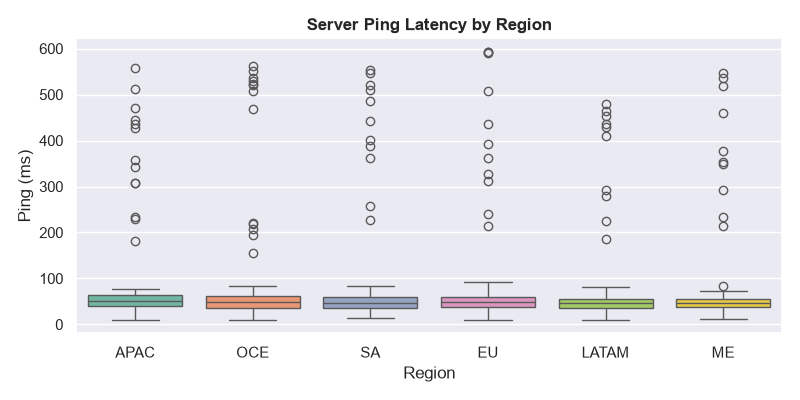
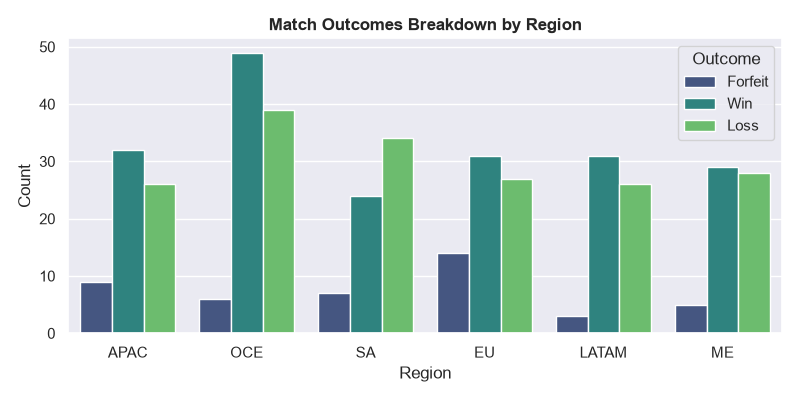

# 🎮 Gaming Rank & Latency Analyzer

Check out the interactive dashboard here: [Live App](https://searchqtejuramesh107-png2fgamingrankanalyzertyperepositories-m.streamlit.app)
## 📌 Project Overview
- **Data Wrangling:** Cleaned raw player, match, and session datasets into a relational SQLite database (`gaming_data.db`).
- **Visual Explorations:** Evaluated ping distributions and win/loss/forfeit rates per region.
- **Statistical Testing:** Conducted a One-Way ANOVA test to check if latency variations across regions are statistically significant.

---

## 📊 Key Findings & Visualizations

### 1. Ping Latency Distribution by Region

- Median ping latencies across APAC, LATAM, and EU remain comparable, with predictable high-latency outliers.

### 2. Match Outcome Breakdown by Region

- Evaluated win, loss, and forfeit rates per region to analyze competitive balance.

---

## 🔬 Statistical Analysis (ANOVA)
- **Null Hypothesis ($H_0$):** Mean ping latency is equal across all regions.
- **F-Statistic:** `2.8991`
- **P-Value:** `0.0562` ($p > 0.05$)
- **Conclusion:** We fail to reject the null hypothesis. There is no statistically significant difference in ping latency across regions at the 5% significance level.

---

## 🛠️ Environment Setup & Running

```bash
# Clone the repository
git clone
cd gaming_rank_analyzer

# Install dependencies
pip install -r requirements.txt 